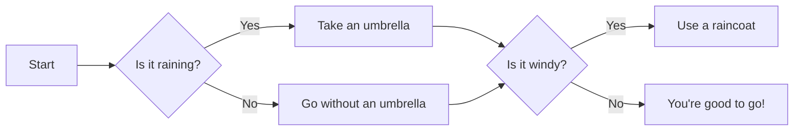

```mermaid
graph LR
    A[Start] --> B{Is it raining?}
    B -->|Yes| C[Take an umbrella]
    B -->|No| D[Go without an umbrella]
    C --> E{Is it windy?}
    D --> E
    E -->|Yes| F[Use a raincoat]
    E -->|No| G[You're good to go!]
```
